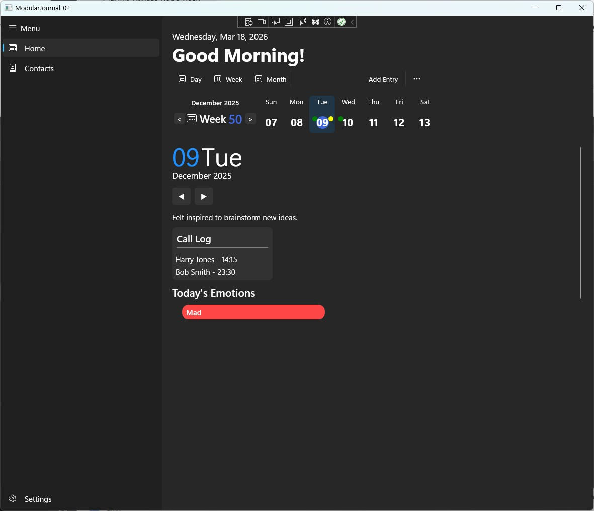
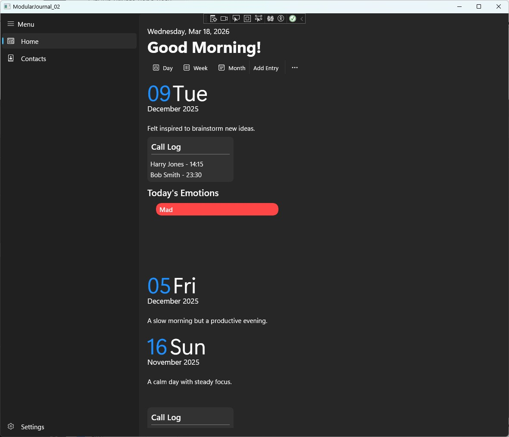
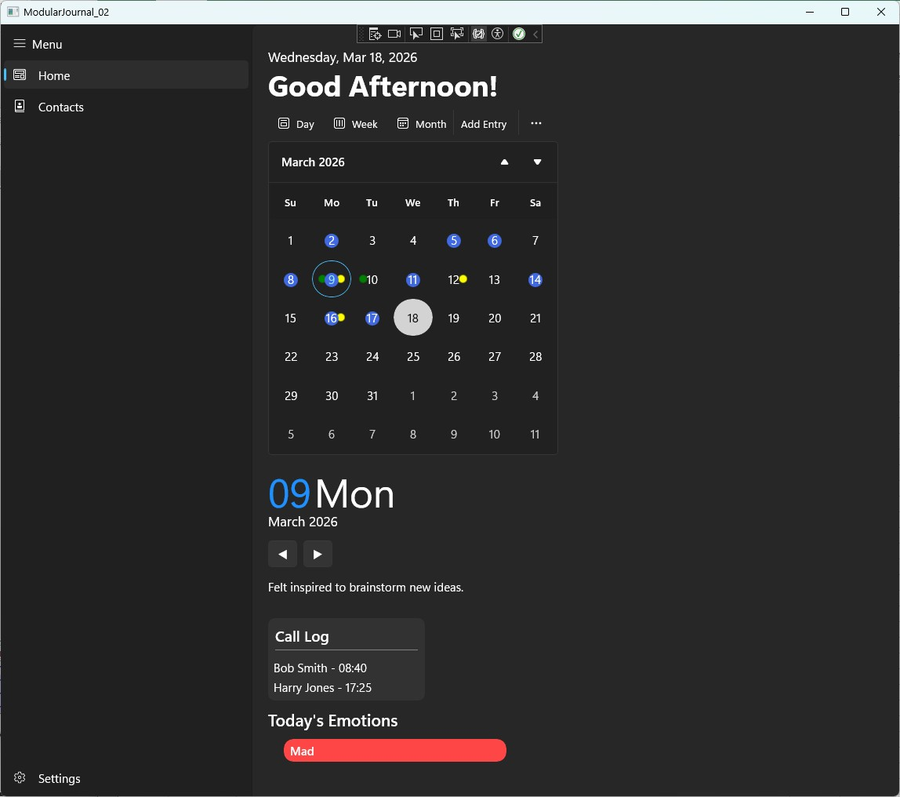
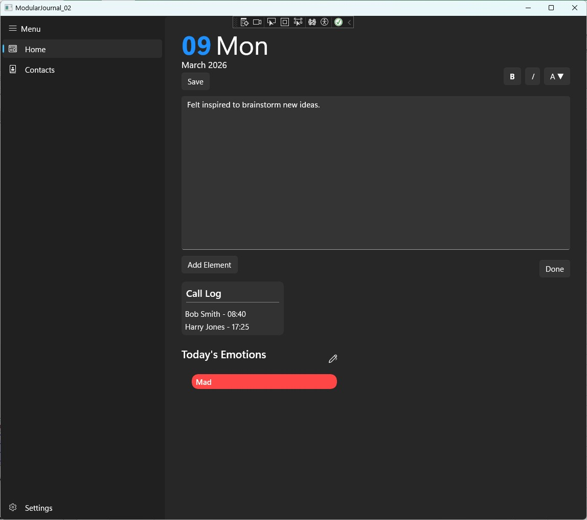

# Portfolio
Sample code from projects I have developed.

# Modular Journal Application

A modular journaling system designed with a focus on **extensibility, scalable UI rendering, and hybrid data persistence**.

---

## Overview

This project implements a flexible journaling architecture where features are composed through dynamically attached modules. Each module encapsulates its own **data storage, UI rendering, and lifecycle behavior**, allowing the system to scale without modifying core application logic.

The design emphasizes separation of concerns across **data models, service layer, and UI composition**, enabling efficient data access patterns and responsive user experiences.

---

## Key Features

- **Modular Plugin Architecture**
  - Journal features implemented as independent modules
  - Modules dynamically registered and resolved at runtime
  - Enables extensibility without modifying core code

- **Dual Persistence Strategy**
  - JSON-based storage for portability and flexibility
  - SQLite-backed storage for structured queries and performance
  - Modules coordinate both storage mechanisms transparently

- **Lazy Module Resolution**
  - Modules instantiated only when needed
  - Cached using a dictionary-based lookup system
  - Reduces initialization overhead and improves performance

- **Incremental UI Rendering**
  - Journal entries loaded dynamically based on scroll position
  - Supports bidirectional navigation (previous / next entries)
  - Avoids rendering large datasets upfront

- **Module-Driven UI Composition**
  - UI elements generated directly by domain modules
  - Decouples feature logic from page-level UI code
  - Improves maintainability and scalability

---

## Architecture
UI Layer (Day View / Week View)
↓
Incremental Loader (Scroll-driven)
↓
Service Layer (JournalService)
↓
Module System (IJnlModule)
↓
| JSON Storage | SQLite Storage |


---

## Core Design Patterns

### Modular Plugin System
Each feature is implemented as a module conforming to a shared interface. Modules encapsulate:
- persistence logic
- UI rendering
- data access
- lifecycle behavior

### Service Layer Abstraction
A centralized service coordinates:
- entry retrieval
- navigation (previous / next)
- interaction with modules

### Hybrid Persistence Model
- JSON enables flexible schema evolution
- SQLite enables efficient querying
- Modules integrate both approaches seamlessly

### Incremental Data Loading
- UI loads entries on demand
- Scroll position determines data fetch direction
- Minimizes memory usage and improves responsiveness

---

## Representative Code Snippets

### 1. Modular Contract

```csharp
public interface IJnlModule
{
    string ModuleKey { get; }

    Windows.UI.Color ModuleColor { get; set; }

    void OnLoaded();

    void LoadFromJson(JsonElement element, SQLiteConnection connection);
    void IntializeDatabase(SQLiteConnection connection);

    void SetContents(DateTime date, object obj);
    object GetContents(DateTime date);

    object? GetJournalElement(DateTime date);
    object? GetTempElement(DateTime date, object data);

    IEnumerable<string> GetAvailableWidgets();
    object? GetWidget(string widgetKey);

    bool HasDataForDate(DateTime date);
    IEnumerable<DateTime> GetDatesWithData();
}
```
### 2. Lazy Module Resolution
```csharp
public T GetOrCreateModule<T>() where T : IJnlModule, new()
{
    var key = new T().ModuleKey;

    if (!_modules.TryGetValue(key, out var module))
    {
        module = new T();
        _modules[key] = module;
    }

    return (T)module;
}
```
### 3. Module-Driven UI Composition
```csharp
public object? BuildJournalElement<T>(DateTime date) where T : IJnlModule, new()
{
    var module = GetOrCreateModule<T>();

    if (!module.HasDataForDate(date))
        return null;

    return module.GetJournalElement(date);
}
```
### 4. Incremental UI Loading
```csharp
public async Task LoadPreviousAsync()
{
    var entry = _journalService.GetAdjacentEntry(_currentTopDate, previous: true);

    if (entry == null)
        return;

    var element = CreateDayBlock(entry);

    _container.Children.Insert(0, element);
    _currentTopDate = entry.Date;
}
```
### 5. Dual Persistence Coordination
```csharp
public void LoadModule(IJnlModule module, JsonElement jsonData)
{
    module.LoadFromJson(jsonData, _connection);
    module.OnLoaded();
}
```
---
### Screenshots




---
### Design Considerations
- **Extensibility First**
  - New features can be added as modules without modifying existing code
- **Separation of Concerns**
  - UI, data, and persistence responsibilities are clearly divided
- **Performance-Aware UI**
  - Incremental loading avoids unnecessary rendering
- **Flexible Data Model**
  - Hybrid persistence allows both structure and adaptability
---
### Notes
- Full production implementation is maintained in a private repository
- This repository highlights key architectural patterns and representative code 
---
### Future Improvements
- Introduce stronger typing to reduce reliance on object
- Expand dependency injection for module lifecycle management
- Add caching strategies for frequently accessed data
- Improve test coverage across service and module layers
---
### Summary
This project demonstrates
- plugin-style architecture
- hybrid persistence strategy
- service-layer abstraction
- dynamic UI composition
- incremental data loading


